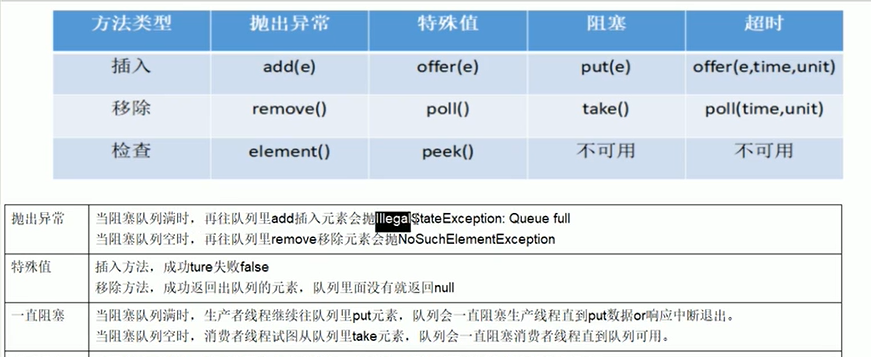
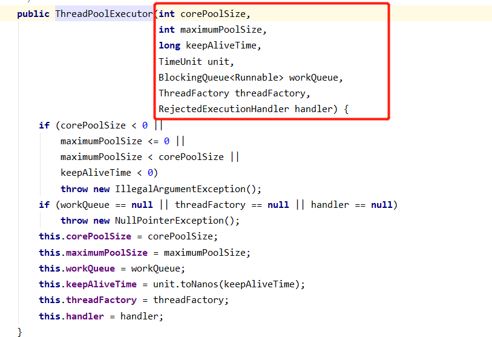

### 一、锁

公平锁/非公平锁/可重入锁/递归锁/自旋锁

1.公平锁和非公平锁：
> - 是什么：ReetrantLock(true)：true公平，默认false 非公平锁，公平锁就是队列，先来后到，先到先得。非公平锁允许抢锁，有可能会造成优先级反转成饥饿现象。
> - 两者区别：
>> - 公平锁：按照申请顺序排列，在并发环境中，每个线程在获取锁时会先查看此锁维护的等待队列，如果为空，或者当前线程时等待队列的第一个，就占有锁，否则就会加入到等待队列中，以后会按照FIFO的规则从队列中取到自己
>> - 非公平锁：上来就尝试占有锁，如果尝试失败，就再采用类似公平锁那种方式，排到队尾, synchronized也是一种非公平锁

2.可重入锁（又名递归锁）:
> - 是什么：指的是同一线程外层函数获得锁之后，内层递归函数仍然能获得该锁的代码，在同一个线程在外层方法获取锁的时候，在进入内层方法会自动获取锁，也就是说，线程可以进入任何一个他已经拥有的锁所同步着的代码块（同步方法里面访问另一个同步方法）, eg.
```xml
Public sync method01(){
    Method02()
}
Public sync method02(){}
```
> - reentrantLock/synchronize就是一个典型的可重入锁
> - 可重入锁最大的作用是为了防止死锁
```xml
class Phone implements Runnable{
    public synchronized  void sendSms() {
        System.out.println(Thread.currentThread().getId() + "\t invoke sendSms()");
        sendEmail();
    }
    public synchronized  void sendEmail() {
        System.out.println(Thread.currentThread().getId() + "\t invoke sendEmail()");
    }
    ReentrantLock reentrantLock = new ReentrantLock();
    @Override
    public void run() {
        get();
    }

    public void get(){
        reentrantLock.lock();

        try {
            System.out.println(Thread.currentThread().getId() + "\t invoke get()");
            set();
        } finally {
            reentrantLock.unlock();
        }
    }

    public void set(){
        reentrantLock.lock();

        try {
            System.out.println(Thread.currentThread().getId() + "\t invoke set()");
        } finally {
            reentrantLock.unlock();
        }
    }
}
public class ReentrantLockDemo {

    public static void main(String[] args) {
        Phone phone =new Phone();
        new Thread(() -> {
            phone.sendSms();
        },"t1").start();
        new Thread(() -> {
            phone.sendEmail();
        }, "t2").start();

        try {
            TimeUnit.SECONDS.sleep(1);
        } catch (InterruptedException e) {
            e.printStackTrace();
        }

        Thread thread = new Thread(phone, "t3");
        Thread thread1 = new Thread(phone, "t4");
        thread.start();
        thread1.start();
    }
}
```

3.自旋锁：
> - 是什么：是指尝试获取锁的线程不会立即阻塞，而是采用循环的方式去尝试获取锁，这样的好处是减少线程上下文切换的消耗，缺点是循环会消耗cpu

eg.
```xml
public class SpinLockDemo {

    // 原子引用线程
    AtomicReference<Thread> atomicReference = new AtomicReference<>();

    public static void main(String[] args) {
        SpinLockDemo spinLockDemo = new SpinLockDemo();
        new Thread(() -> {
            spinLockDemo.myLock();

            try {
                TimeUnit.SECONDS.sleep(5);
            } catch (InterruptedException e) {
                e.printStackTrace();
            }
            spinLockDemo.myUnLock();
        }, "AA").start();

        new Thread(() -> {
            spinLockDemo.myLock();

            try {
                TimeUnit.SECONDS.sleep(1);
            } catch (InterruptedException e) {
                e.printStackTrace();
            }
            spinLockDemo.myUnLock();
        }, "BB").start();
    }

    public void myLock() {
        Thread thread = Thread.currentThread();
        System.out.println(Thread.currentThread().getName() + "\t come in");

        while (!atomicReference.compareAndSet(null, thread)){

        }
    }

    public void myUnLock() {
        Thread thread = Thread.currentThread();
        atomicReference.compareAndSet(thread, null);
        System.out.println(Thread.currentThread().getName() + "\t invoked myUnLock");

    }
}
```

4.独占锁（写锁）/共享锁（读锁）/互斥锁：
> - 是什么：
>> - 独占锁：指该锁一次只能被一个线程所持有，对ReentrantLock和synchronize而言都是独占锁
>> - 共享锁：指该锁可被多个线程所持有，对ReetrantReadWriteLock，其读锁是共享锁，其写锁是独占锁，读锁的共享锁可保证并发读是非常高效的，读写，写读，写写的过程是互斥的

写操作：原子+独占，中间不能被打断

5.闭锁CountDownLatch：
> - countDownLatch.countDown();减数，countDownLatch.await(); 等待，一直减数到0才往下执行
> - 让一些线程阻塞直到另一些线程完成一系列操作（初始值是0，直到具体设定值，才会执行后续的操作（做加法））
> - CyclicBarrier：可循环使用的屏障，让一组线程到达一个屏障（也可以叫同步）时被阻塞，直到最后一个屏障时，屏障才会开门，所有被屏障拦截的线程才会继续操作。（设置初始值，做减法，才会继续执行后续的操作）
> - Semaphore：信号量主要用于两个目的，一个时用于多个共享资源的互斥使用，另一个用于并发线程数的控制

synchronize和lock的区别：
> - synchronize是关键字属于jvm层面，monitorenter（底层是通过monitor对象来完成，其实wait/notify等方法也依赖monitor对象只有在同步块或方法中才能调wait/notify等方法monitorexit代表出锁，lock是具体类（java.util.concurrent.locks.lock），是api层面的锁
> - synchronize不需要用户手动释放锁，当synchronized代码执行完成后系统会自动让线程释放对锁的占用，ReenTrantLock则需要用户去手动释放锁，若没有主动释放锁，就有可能导致出现死锁现象。需要lock()和unlock()方法配合try/finally语句块来完成
> - synchronized不可中断，除非抛出异常或者正常运行完成，ReetrantLock可中断：1.设置超时方法tryLock（long time，TimeUnit unit） 2. lockInterruptibly()放代码块中，调用interrupt方法可中断
> - 加锁是否公平：synchronized非公平锁，ReetrantLock两者都可以，默认非公平锁，构造方法可以传入boolean值，true为公平锁，false为非公平锁
> - 锁绑定多个条件condition：synchronized没有，ReentrantLock用来实现分组唤醒需要唤醒的的线程们，可以精确唤醒，而不是像synchronized要么随机唤醒一个线程，要么唤醒全部线程

### 二、阻塞队列

1.队列：
> - ArrayBlockingQueue：是一个基于数据结构的有界阻塞队列，此队列按FIFO（先进先出）原则对元素进行排序
> - LinkedBlockingQueue：是一个基于链表结构的有界阻塞队列，此队列按FIFO排序元素，吞吐量通常要高于ArrayBlockingQueue(LinkedBlockingQueue的有界21亿（Integer.MAX_VALUE）的有界范围，近似于无界，慎用)
> - SynchronousQueue：一个不存储元素的阻塞队列，每个插入操作必须等到另一个线程调用移除操作，否则插入操作一直处于阻塞状态，吞吐量通常要高于(SynchronousQueue 生产一个消费一个，不消费不会继续生产下一个队列，每一个put操作必须跟一个take操作)

2.阻塞队列：
> - 当阻塞队列是空时，从队列中获取元素的操作将会被阻塞
> - 当阻塞队列时满时，往队列里添加元素的操作将会被阻塞
> - 试图从空的阻塞队列中获取元素的线程将会被阻塞，直到其他的线程往空的队列插入新的元素
> - 试图往已满的阻塞队列中添加新元素的的线程同样会被阻塞，直到其他的线程从列中移除一个或者多个元素或者完全清空队列后使队列重新变得空闲起来并后续新增

在多线程领域，所谓阻塞，在某些情况下会挂起线程（即阻塞），一旦条件满足，被挂起的线程又会被自动唤醒

优势：为什么需要BlockingQueue：好处时我们不需要关心什么时候需要阻塞线程，什么时候需要唤醒线程，因为这一切BlockingQueue都包办了



### 三、生产者消费者

虚假唤醒：使用while判断防止虚假唤醒

```xml
class ShareData{
    private int number = 0;
    private Lock lock = new ReentrantLock();
    private Condition condition = lock.newCondition();

    public void increment() throws Exception{
        lock.lock();
        try {
            // 1.判断
            while (number != 0){
                // 等待，不生产
                condition.await();
            }
            // 2.干活
            number++;
            System.out.println(Thread.currentThread().getName() + "\t" + number);
            // 3.通知唤醒
            condition.signalAll();
        } catch (InterruptedException e) {
            e.printStackTrace();
        } finally {
            lock.unlock();
        }
    }

    public void decrement() throws Exception{
        lock.lock();
        try {
            // 1.判断
            while (number == 0){
                // 等待，不生产
                condition.await();
            }
            // 2.干活
            number--;
            System.out.println(Thread.currentThread().getName() + "\t" + number);
            // 3.通知唤醒
            condition.signalAll();
        } catch (InterruptedException e) {
            e.printStackTrace();
        } finally {
            lock.unlock();
        }
    }
}
public class ProdConsumerTraditionDemo {

    public static void main(String[] args) {
        ShareData shareData = new ShareData();
        new Thread(() -> {
            for (int i = 0; i < 5; i++) {
                try {
                    shareData.increment();
                } catch (Exception e) {
                    e.printStackTrace();
                }
            }
        }, "AA").start();

        new Thread(() -> {
            for (int i = 0; i < 5; i++) {
                try {
                    shareData.decrement();
                } catch (Exception e) {
                    e.printStackTrace();
                }
            }
        }, "BB").start();
    }
}
```

### 四、callable

callable与runnable区别：callable有返回值，依靠futureTask中间类，futureTask.get()建议放在后面，如果没有计算完成就要去强求，会导致阻塞，值得计算完成

```xml
class MyThread implements Callable<Integer> {

    @Override
    public Integer call() throws Exception {
        System.out.println("******* come in callable");
        return 1024;
    }
}

public class CallableDemo {

    // 多个线程争抢futureTask，一个线程只进去一次
    public static void main(String[] args) throws InterruptedException, ExecutionException {
        FutureTask<Integer> futureTask = new FutureTask<>(new MyThread());
        FutureTask<Integer> futureTask1 = new FutureTask<>(new MyThread());

        Thread t1 = new Thread(futureTask, "AA");
        Thread t2 = new Thread(futureTask1, "BB");
        t1.start();
        int result01 = 100;
        /*while (futureTask.isDone()) {

        }*/
        int result = futureTask.get();
        System.out.println("**** result " + (result01 + result));


    }
}
```

### 五、线程池

线程池做的工作主要是控制运行的线程的数量，处理过程中将任务放入队列，然后在线程创建后启动这些任务，如果线程数量超过了最大数量，超出数量的线程排队等候，等其他线程执行完毕，再从队列中取出任务来执行。

> 线程池的主要特点：线程服用，控制最大并发数，管理线程

1.为什么要用线程池，优势：
> - 降低资源消耗，通过重复利用已创建的线程降低线程创建和销毁造成的消耗
> - 提高响应速度，当任务到达时，任务可以并不需要等到线程创建就能立即使用
> - 提高线程的可管理型，线程是稀缺资源，如果无限制的创建，不仅会消耗系统资源 ，还会降低系统的稳定性，使用线程池可以进行同意的分配，调优和监控

2.线程池分类：
> - Executors.newFixedThreadPool(5); 创建固定线程数 5（执行长期的任务，性能好很多）
> - Executors.newSingleThreadExecutor(）; 一池添加1个线程 （一个任务一个任务执行的场景）
> - Executors.newCachedThreadPool();一池添加多个线程 （适用：执行很多短期异步的小程序或者负载较轻的服务器）

3.线程池几个重要的参数（7大参数）：


> - corePoolSize：线程池中的常驻核心线程数（1.在创建线程池后，当有请求任务来之后，就会安排池中的线程去执行请求任务，近似理解为今日当值线程  2.当线程池中的线程数目的达到corePoolSize后，就会把到达的任务放到缓存队列当中）
> - maximumPoolSize：线程池能够容纳同时执行的最大线程数，此值必须大于等于1
> - keepAliveTime：多余的空闲线程的存活时间，当前线程数超过corePoolSize，当空闲时间达到KeepAliveTime值时，多余空闲线程会被销毁直至只剩下corePoolSize个线程为止（默认情况下：只有当线程池中的线程数大于corePoolSize时keepAliveTime才会起作用给，直到线程池中的线程数不大于corePoolSize）
> - TimeUnit（unit）：keepAliveTime的单位
> - workQueue：任务队列，被提交但尚未被执行的任务
> - threadFactory：表示生成线程池中工作线程的线程工厂，用于创建线程，一般用默认的即可
> - handler：拒绝策略，表示当队列满了并且工作线程大于等于最大线程数（maximumPoolSize）

4.线程池的底层工作原理：
> - 在创建线程池后，等待提交过来的任务请求
> - 当调用execute（）方法添加一个任务请求时，线程池会做如下判断：
>> - 如果正在运行的线程数量小于corePoolSize，那么马上创建线程运行这个任务
>> - 如果正在运行的线程数量大于或等于corePoolSize，那么马上创建线程运行这个任务
>> - 如果这时候队列满了且正在运行的线程数量还小于maximumPoolSize，那么还是要创建非核心线程立刻运行这个任务
>> - 如果队列满了且正在运行的线程数量小于或等于maximumPoolSize，那么线程会启动饱和拒绝策略来执行
> - 当一个线程完成任务时，他会从队列中取下一个任务来执行
> - 当一个线程无事可做超过一定时间（keepAliveTime）时，线程池会判断：
>> - 如果当前运行的线程数大于corePoolSize，那么这个线程就被停掉
>> - 所以线程池的所有任务完成后它最终会收缩到corePoolSize的大小

5.如何合理的配置线程池参数：
> - CPU密集型
>> - CPU密集的意思时该任务需要大量的运算，而没有阻塞，CPU一直全速运行;CPU密集任务只有在真正的多核CPU上才可能得到加速（通过多线程）;而在单核CPU上，无论你开几个模拟的多线程该任务都不可能得到加速,因为CPU总的运算能力就那些;CPU密集型任务配置尽可能少的线程数量：一办公式：CPU核数+1个线程的线程池
> - IO密集型
>> - 由于IP密集型任务并不是一直在执行任务，则应该配置尽可能多的线程，如CPU核心线程数*2
>> - IO密集型，即该任务需要大量的IO，即大量的阻塞,在单线程运行IO密集型的任务会导致浪费大量的CPU运算能力浪费在等待所以在IO密集型任务中使用多线程可以大大的加速程序运行，即使在单核CPU上，这种加速主要就是利用了被浪费掉的阻塞时间

> IO密集型时，大部分线程都阻塞，故需要多配置线程数
参考公式：CPU核心数/1-阻塞系统  阻塞系数在0.8-0.9之间
Eg. 8/1-0.9 = 80个线程数

6.死锁编码及定位分析
> - 死锁是什么：死锁是指两个或两个以上的进程在执行过程中，因争夺资源而造成的一种互相等待的现象，若无外力干涉那他们都将无法推进下去，如果系统资源充足，进程的资源请求都能够得到满足，死锁出现的可能性就很低，否则就会因争夺有限的资源而陷入死锁
> - 主要原因：①系统资源不足 ②进程运行推进的顺序不合适 ③资源分配不当

7.jvm命令（死锁定位故障）
> - jps近似ps -ef|grep xxx  查看进程，jps查看java进程，jps -l
> - Jstack pid 查看具体代码故障位置
