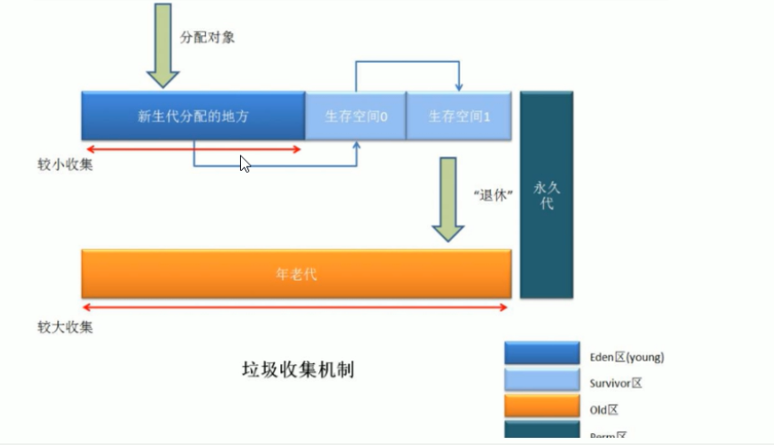

### 一、体系结构


### 二、类装载器

> 类装载器ClassLoader：负责加载class文件，class文件在**文件开头有特定的文件标识（cafe babe...）**，将class文件字节码内容加载到内存中，并将这些内容转换成方法区中的运行时数据结构并且classLoder只负责class文件的加载，值与它是否可以运行，则由Execution Engine决定


类加载器 就是根据指定全限定名称将class文件加载到JVM内存，转为Class对象。

虚拟机自带的加载器(系统自带)：
> - 启动类加载器（Bootstrap）C++ （Object对象获取加载器为null，因为Bootstrap对应的C++为最高级）
> - 扩展类加载器（Extension）JAVA
> - 应用程序类加载器（AppClassLoader）java也叫系统类加载器，加载当前应用的classPath的所有类（自创建的对象eg MyObject获取加载器为AppClassLoader）

用户自定义加载器:
> java.lang.ClassLoader的子类，用户可以定制类的加载方式


ClassLoader的双亲委派机制
> 当一个类收到了类加载请求，它首先不会尝试自己去加载这个类，而是把这个请求委派给父类去完成，每一个层次类加载器都是如此，因此所有的加载请求都应该传送到启动类加载其中，只有当父类加载器反馈自己无法完成这个请求的时候（在它的加载路径下没有找到所需加载的class），子类加载器才会去尝试自己加载。采用双亲委派的一个好处就是比如加载位于rt.jar包中的类java.lang.Object，不管是哪个加载器加载这个类，最终都是委托给顶层的启动类加载器进行加载，这样就保证了使用不同的类加载器最终得到的都是同样一个Object对象

Execution Engine执行引擎负责解释命令，提交操作系统执行

沙箱安全机制：防止恶意代码污染java源代码，eg String

### 三、本地方法栈

本地方法接口Native修饰放于本地方法栈中运行，eg Thread中的start方法

> - Nativ Interface本地接口：本地接口的作用是融合不同的语言变成为java所用，他的初衷是融合C/C++程序
> - Native Method Stack：Native MethodStack中等级native方法，在Execution Engine执行时加载本地方法库

native关键字，有声明，无实现，调用第三方C语言函数库去实现

**线程私有：java栈、程序计数器、本地方法栈（线程私有的部分不需要GC）**

### 四、程序计数器（Program Counter Register）

> - PC寄存器：位于cpu中，每个线程都有一个程序计数器，是**线程私有**的，就是一个指针，指向方法区中的方法字节码（**用来存储指向下一条指令的地址，也即将要执行的指令代码**），由执行引擎读取下一条指令，是一个非常小的内存空间，几乎可以忽略不记。
> - 这块内存区域很小，他是**当前线程所执行的字节码的行号指示器**，字节码解释器通过改变这个计数器的值来选取下一条需要执行的字节码指令
> - 如果执行的是一个Native方法，那这个计数器是空的
> - 用以完成分支、循环、跳转、异常处理、线程恢复等基础功能。不会发生内存溢出（OutOfMemoryError=OOM）错误

### 五、方法区

> 供各线程共享的运行时内存区域。**它存储了每一个类得结构信息**，例如运行时常量池（Runtime Constant Pool）、字段和方法数据、构造函数和普通方法的字节码内容。上面讲得是规范，在不同虚拟机里头实现是不一样的，最典型的就是永久代（PermGen space）和元空间（Metaspace），但是，**实例变量存在堆内存中，和方法区无关**

### 六、Java栈（栈管运行，堆管存储）

> 栈也叫栈内存，主管Java程序的运行，是在线程创建时创建，它的生命期是跟随线程的生命期，线程结束栈内存也就释放，**对于栈来说不存在垃圾回收问题**，只要线程一结束该栈就over，生命周期和线程一致，是线程私有的。**8种基本类型的变量+对象的引用变量+实例方法都是在函数的栈内存中分配**

栈帧中主要保存3类数据：
> - 本地变量（Local Variables）：输入参数和输出参数以及方法内的变量
> - 栈操作（Operand Stack）：记录出栈、入栈的操作
> - 栈帧数据（Frame Data）：包括类文件、方法等

队列（先进先出 eg 排队打饭），栈（后进先出 eg 子弹匣）

> 每个方法执行的同时都会创建一个栈帧，用于存储局部变量表、操作数栈、动态链接、方法出口等信息，每一个方法从调用直至执行完毕的过程，就对应着一个栈帧在虚拟机中入栈到出占的过程。栈的大小和具体JVM的实现有关，通常在256~756k之间，与等于1mb左右。

java.lang.StackOverflowError栈溢出：
> 由线程请求的栈深度大于虚拟机所允许的最大深度所造成，方法嵌套过深 eg 参考递归，使用-Xss调整jvm栈的大小

HotSpot是使用指针的方式来访问对象：Java堆中会存放访问类**元数据**的地址，reference存储的就直接是对象的地址

栈+堆+方法区的交互关系：


> 针对于reference对象，存储在java堆中，但它区分模板的不同则是根据方法区中的对象类型数据

### 七、Java堆

一个JVM实例只存在一个堆内存，堆内存的大小是可以调节的，类加载器读取了类文件后，需要把类、方法、常变量放到堆内存中，保存所有引用类型的真实信息，以方便执行器执行，堆内存分为三部分：
> - Young Generation Space 新生代：Young/New（eden区、Survivor 0区（from）、Survivor  1区（to））
> - Tenure Generation Space 老年代 Old/Tenure
> - Permanent Space 永久代 Perm（1.7V） 元空间（1.8V），对应Method Area

> 新生区是类的诞生、成长、消亡的区域，一个类在这里产生，应用，最后被垃圾回收器收集，结束生命。新生区分为两部分：eden space和suvivor space，所有的类都是在eden区被new出来的，survivor区中有0区和1区，当eden区的空间用完时，程序又需要创建对象，JVM的垃圾回收器对eden进行垃圾回收（Young GC/Minor GC），将eden区中的不再被其他对象所引用的对象进行销毁，然后将eden区中的剩余对象移动到survivor0区，若survivor 0区也满了，再对该区进行垃圾回收，然后移动到1区，若1区满了，再移动到养老区，若养老区也满了，则会触发Full GC，进行养老区的内存清理，若养老区执行了full GC后依然无法进行对象的保存，则会产生java.lang.OutOfMemoryError:java heap space异常
> - 如果出现OOM异常，说明java虚拟机的堆内存不够，原因：
>> - java虚拟机的堆内存设置不够，可以通过参数-Xms、-Xmx来调整
>> - 代码中创建了大量大对象，并且长时间不能被垃圾收集器收集（存在被引用）

参数配置：
> - 默认的，新生代 ( Young ) 与老年代 ( Old ) 的比例的值为 1:2 ，可以通过参数 –XX:NewRatio 配置。
> - 默认的，Eden : from : to = 8 : 1 : 1 ( 可以通过参数 –XX:SurvivorRatio 来设定)
> - Survivor区中的对象被复制次数为15(对应虚拟机参数 -XX:+MaxTenuringThreshold)

为什么要分为Eden和Survivor?为什么要设置两个Survivor区？
> - 如果没有Survivor，Eden区每进行一次Minor GC，存活的对象就会被送到老年代。老年代很快被填满，触发Major GC.老年代的内存空间远大于新生代，进行一次Full GC消耗的时间比Minor GC长得多,所以需要分为Eden和Survivor
> - Survivor的存在意义，就是减少被送到老年代的对象，进而减少Full GC的发生，Survivor的预筛选保证，只有经历15(可调整)次Minor GC还能在新生代中存活的对象，才会被送到老年代。
> - 设置两个Survivor区最大的好处就是解决了碎片化，刚刚新建的对象在Eden中，经历一次Minor GC，Eden中的存活对象就会被移动到第一块survivor space S0，Eden被清空；等Eden区再满了，就再触发一次Minor GC，Eden和S0中的存活对象又会被复制送入第二块survivor space S1（这个过程非常重要，因为这种复制算法保证了S1中来自S0和Eden两部分的存活对象占用连续的内存空间，**避免了碎片化的发生**）

from区和to区，他们的位置不是固定的，每次GC后回交换，谁空谁是to区


> - eden、Survivor From复制到Survivor To，年龄+1：首先，当eden区满的时候会触发第一次GC，把还活着的对象拷贝到Survivor From区，当eden区再次触发GC的时候会扫描eden区和From区域，对这两个区域进行垃圾回收，经过这次回收后还存活的对象，则直接复制到To区域（如果有对象的年龄已经达到了老年的标准，则复制到老年代区），同时把这些对象的年龄+1。
> - 清空eden、Survivor From：然后，清空eden和Survivor From中的对象，也即复制之后有交换，谁空谁是to
> - Survivor To和Survivor From互换：最后，Survivor To和Survivor From互换，原SurvivorTo成为下一次GC时的Survivor From区。部分对象会在From和To区域中复制来复制去，如此交换15次（由JVM参数MaxTenuringThreshold决定，此参数默认是15），最终如果还是存活，就存入到老年代

Full GC和Major GC的区别：
> - Full GC 清理整个内存堆 – 包括年轻代和年老代
> - Major GC 发生在老年代的GC，清理老年区，经常会伴随至少一次Minor GC，比Minor GC慢10倍以上

**JVM规范将方法区描述为堆的一个逻辑部分，但它还有一个别名叫做Non-Heap（非堆），目的就是要和堆分开。**

对于HotSpot虚拟机，很多开发者习惯将方法区称之为永久代（Permanent Gen），但严格本质上说两者不同，或者说使用永久代来实现方法区而已，永久代是方法区（相当于是一个接口interface）的一个实现，jdk1.7的版本中，已经将原本放在永久代的字符串常量池移走


永久区（java7之前有）：

    永久存储区是一个常驻内存区域，用于存放JDK自身所携带的Class，Interface的元数据，也就是说它存储的是运行环境必须的类信息，被装在进此区域的数据是不会被垃圾回收器回收掉的，关闭JVM才会释放此区域所占用的内存（eg jar包）

### 八、堆参数的调优

java1.7


java1.8


Java8
> 在java8中，永久代已经被移除，被一个称为元空间的区域所取代，元空间的本质和永久代类似。元空间与永久代之间最大的区别在于：永久代使用的JVM的堆内存，**但是java8以后的元空间并不在虚拟机中而是使用本机物理内存**，因此，默认情况下，元空间的大小仅受本地内存限制，类的元数据放入native memory，字符串池和类的静态变量放入java堆中，这样可以加载多少类的元数据就不再由maxPermSize控制，而由系统的实际可用空间来控制

#### 8.1、堆内存调优

| 参数  | 含义                                |
| -----  | ------------------------------------|
| -Xms  | 设置初始分配大小，默认为物理内存的1/64  |
| -Xmx  | 最大分配内存，默认为物理内存的1/4      |
| -XX:+PrintGCDetails  | 输出详细的GC处理日志   |

```
public class T2 {

    public static void main(String[] args) {
        // 最大 -Xmx
        System.out.println(Runtime.getRuntime().maxMemory());
        // 默认初始大小 -Xms
        System.out.println(Runtime.getRuntime().totalMemory());
        // cpu核数
        System.out.println(Runtime.getRuntime().availableProcessors());
    }
}

初始内存要和最大内存一样大，避免GC和应用程序争抢内存，理论值峰值和峰谷忽高忽低

VM option: -Xms1024M -Xmx1024M -XX:+PrintGCDetails

```

GC回收日志Young区参数解释，Young区占总内存的1/3


GC回收日志Old区参数解释


### 九、GC算法总体概述



JVM在进行GC时，并非每次都对上面三个内存区域一起回收的，大部分时候回收的都是指新生代，因此GC按照回收的区域又分了两种类型，一种时普通GC（minor GC），一种时全局GC（major GC or FUll GC）

Minor GC 和 FUll GC的区别：

> - 普通GC（minor GC）：只针对新生代区域的GC，指发生在新生代的垃圾收集动作，因为大多数java对象存活率都不高，所以minor GC非常频繁，一般回收速度也比较快
> - 全局GC（major GC or Full GC）：指发生在老年代的垃圾收集动作，出现Major GC，经常会伴随至少一次的minor GC（但并不是绝对的）。Major GC的速度一般要比minor GC慢上10倍以上

### 十、四大算法

> - 引用计数法：计数器中计算有对象引用的当前对象，有引用就计数累加1，如果没有则减1，减到0就可回收（无法解决循环引用的问题）
> - 复制算法（Copying）：新生代中使用的是minor GC，这种GC算法采用的是复制算法
>> - HotSpot JVM把年轻代分为三部分，1个Eden和2个Suvivor（分别叫from和to），默认比例8：1：1，一般情况下，将创建的对象都会被分配到Eden区（一些大对象特殊处理），这些对象经过第一次Minor GC后，如果仍然存活，将会被移动到Survivor区，对象在Survivor区中每熬过一次Minor GC，年龄就会增加1岁，当他的年龄增加到一定程度时，就会被移动到老年代中，因为年轻代中的对象基本都是朝生夕死的（90%以上），**所以在年轻代的垃圾回收算法使用的时复制算法**，复制算法的基本思想就是将内存分为两块，每次只用其中一块，当这一块内存用完，就将还或者的对象复制到另一块上面，**复制算法不会产生内存碎片，但是费空间**
>> - 因为Eden区对象一般存活率较低，一般的，使用两块10%的内存作为空闲和活动区间，而另外80%的内存，则是用来给新键对象分配内存的，一旦发生GC，将10%的from活动区间与另外80%中存活的eden对象转移到10%的to空闲区间，接下来，将之前90%的内存全部释放
> - 标记清除（Mark-Sweep）：老年代一般时由标记清除或者时标记清楚与标记整理的混合实现
>> - 先标记要回收的对象，然后同一回收这些对象，解决了复制算法中的空间浪费的问题，但是两次扫描耗时严重，并且会产生内存碎片
> - 标记整理（Mark-Compact）：标记清除整理内存碎片

复制算法原理：


算法总结：

分代收集算法，针对合适的新生代及老年代使用合适的算法，复制用于新生代，标记清除、标记整理用于老年代

> - 内存效率：复制 > 标记清除 > 标记整理 （仅简单的对比时间复杂度，实际情况不一定如此）
> - 内存整齐度：复制 = 标记整理 > 标记清除
> - 内存利用率：标记整理 = 标记清除 > 复制

年轻代特点时区域相对老年代较小，对象存活率低

老年代的特点是区域较大，对象存活率高

### 十一、四种主要垃圾收集器

> - serial  串行垃圾回收：为单线程环境设计且只使用一个线程进行垃圾回收，会暂停所有的用户线程（stop the world），所以不适合服务器环境
> - ParNew收集器：Serial收集器的多线程版本，也需要stop the world，复制算法
> - Parallel Scavenge收集器： 新生代收集器，复制算法的收集器，并发的多线程收集器，目标是达到一个可控的吞吐量。如果虚拟机总共运行100分钟，其中垃圾花掉1分钟，吞吐量就是99%
> - Serial Old收集器： 是Serial收集器的老年代版本，单线程收集器，使用标记整理算法。
> - Parallel Old收集器： 是Parallel Scavenge收集器的老年代版本，使用多线程，标记-整理算法。
> - CMS(Concurrent Mark Sweep) 并发标记清除（并发垃圾回收器）：是一种以获得最短回收停顿时间为目标的收集器，标记清除算法，运作过程：初始标记，并发标记，重新标记，并发清除，收集结束会产生大量空间碎片,用户线程和垃圾收集线程同时执行（不一定是并行，可能交替执行），不需要停顿用户线程，互联网公司多用它，适用堆响应时间有要求的场景
> - G1垃圾回收器： 标记整理算法实现，运作流程主要包括以下：初始标记，并发标记，最终标记，筛选标记。不会产生空间碎片，可以精确地控制停顿。是一种服务器端的垃圾收集器，应用在多处理器和大容量内存环境中，在实现高吞吐量的同时，尽可能的满足垃圾收集暂停实际按的要求
>> - G1特性：
>>> - 像CMS收集器一样，能与应用程序线程并发执行
>>> - 整理空闲空间更快
>>> - 需要更多的实际按来预测GC停顿时间
>>> - 不希望牺牲大量的吞吐性能
>>> - 不需要更大的java heap

G1特点：
> - G1能充分利用多CPU、多核环境硬件优势，尽量缩短STW(Stop-The-World：是在执行垃圾收集算法时，Java应用程序的其他所有线程都被挂起（除了垃圾收集帮助器之外）)
> - G1整体上采用标记-整理算法，局部是通过复制算法，不会产生内存碎片
> - 宏观上看G1之中不再区分年轻代和老年代，把内存划分成多个独立的子区域（region），可以近似理解为一个围棋的棋盘
> - G1收集器里面讲整个的内存区都混合在一起了，但其本身依然在小范围内要进行年轻代和老年代的区分，保留了新生代和老年代，但他们不再是物理隔离的，而是一部分region的集合且不需要region是连续的，也就是说依然会采用不同的GC方式来处理不同的区域
> - G1虽然也是分代收集器，但整个内存分区不存在物理上的年轻代和老年代的区别，也不需要完全独立的survivor（to space）堆做复制准备，G1只有逻辑上的分代概念，或者说每个分区都可能随G1的运行在不同代之间前后切换

G1底层原理：
> region区域化垃圾收集器，整体编为了一些列不连续的内存区域，避免了全内存区的GC操作，核心思想是将整个堆内存区域分成大小相同的子区域（region），在JVM启动时会自动设置这些子区域的大小，在堆的使用上，G1并不要求对象的存储一定是物理上连续的只要逻辑上连续即可，每个分区也不会固定的为某个代服务。可以按需在年轻代和老年代之间切换，启动时可以通过参数-XX:G1HeapRegionSize=n可指定分区大小（1mb-32mb，且必须是2的幂），默认将整堆划分为2048个分区，大小范围在1mb-32mb，最多能设置2048个区域，也即能够支持的最大内存为：32mb*2048=65536mb=64G内存


### 十二、怎么查看服务器默认的垃圾收集器是哪个？生产上如何配置垃圾收集器的？谈谈你对垃圾收集器的理解？

> java8默认的垃圾收集器是并行回收（使用命令查看：java -xx:+PrintCommandLineFlags -version）

> java的gc回收的类型主要有几种：UseSerialGC、UseParallelGC、UseConcMarksSweepGC、UseParNewGC、UseParallelOldGC、UseG1GC

### 十三、JMM（java的内存模型）

JMM
> JMM本身是一种抽象的概念并不真实存在，它描述的是一组规则或规范，通过这组规范定义了程序中各个变量（包括实例字段，静态字段和构成数组对象的元素）的访问方式

> 由于JVM运行程序的实体是线程，而每个线程创建时JVM都会为其创建一个工作内存（有些地方成为栈空间），工作内存是每个线程的私有数据区域，而Java内存模型中规定所有变量都存储在主内存，主内存是共享内存区域，所有线程都可以访问，**但线程对变量的操作（读取赋值等）必须在工作内存中进行，首先将变量从主内存拷贝到的线程到自己的工作内存空间，然后对变量进行操作，操作完成后再将变量写回主内存**，不能直接操作主内存中的变量，各个线程中的工作内存中存储着主内存中的变量副本拷贝，因此不同的线程间无法访问对方的工作内存，线程间的通信（传值）必须通过主内存来完成，访问过程如下：


特征：
> - 可见性，举例volatile
> - 原子性，要么执行成功，要么失败
> - 有序性，指令重排序

1.指令重排序：
> 在实际运行时，代码指令可能并不是严格按照代码语句顺序执行的。大多数现代微处理器都会采用将指令乱序执行（out-of-order execution，简称OoOE或OOE）的方法，在条件允许的情况下，直接运行当前有能力立即执行的后续指令，避开获取下一条指令所需数据时造成的等待3。通过乱序执行的技术，处理器可以大大提高执行效率。而这就是指令重排。

2.内存屏障：
> - LoadLoad屏障：对于这样的语句Load1; LoadLoad; Load2，在Load2及后续读取操作要读取的数据被访问前，保证Load1要读取的数据被读取完毕。
> - StoreStore屏障：对于这样的语句Store1; StoreStore; Store2，在Store2及后续写入操作执行前，保证Store1的写入操作对其它处理器可见。
> - LoadStore屏障：对于这样的语句Load1; LoadStore; Store2，在Store2及后续写入操作被刷出前，保证Load1要读取的数据被读取完毕。
> - StoreLoad屏障：对于这样的语句Store1; StoreLoad; Load2，在Load2及后续所有读取操作执行前，保证Store1的写入对所有处理器可见。它的开销是四种屏障中最大的。 在大多数处理器的实现中，这个屏障是个万能屏障，兼具其它三种内存屏障的功能。