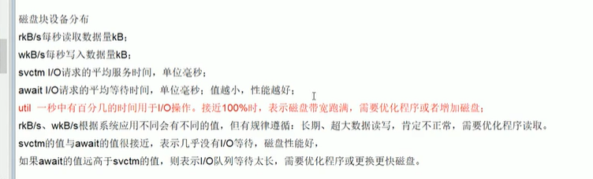

### 一、生产环境服务器变慢，诊断思路和性能评估谈谈？

1.整机：top 查看系统的整机性能，cpu 内存 pid等信息  load average代表系统的负载均衡 ，三个值代表1分钟、5分钟、15分钟系统的平均负载值，三个值相加/100%>60%，说明系统负载中除top外，uptime查看整机性能的精简版

2.CPU：vmstat   vmstat -n 2 3
|  |  |
|--|--|
|procs | r：运行和等待cpu时间片的进程数 b：等待资源的进程数 |
|Cpu | us+sy超过80%说明cpu负载过高，id代表cpu空闲率，越高越好 |

3.内存：free
|  |  |
|--|--|
|free | 查看内存，字节数 |
|free -g | 四舍五入吞了一些内存数 |
|free -m | 推荐使用，准确查看内存数 |
|pidstat -p 进程号 -r 2 | 查看额外 |

4.硬盘：df

> df -h	查看磁盘剩余空间数

5.磁盘IO：iostat
|  |  |
|--|--|
|iostat -xdk 2 3 | 查看磁盘IO占用情况 |
|pidstat -d 2 -p 进程号 | 查看额外 |

6.网络IO：ifstat
> ifstat -1	查看网络IO，网络负载情况

### 二、假如生产环境出现cpu占用过高，谈谈分析思路和定位？

> - 先用top命令找出cpu占比最高的，记录pid
> - ps -ef | grep pid 或jps -l找出java的进程号
> - 定位到具体线程或代码
>> - Ps -mp 进程号 -o THREAD,tid,time：哪个线程占用了多少时间
>>> - -m显示所有的线程
>>> - -p pid进程使用cpu的时间
>>> - -o 该参数后是用户自定义格式
> - 将需要的线程ID转换为16进制格式（英文小写格式）： printf "%x\n" 有问题的pid对应的16进制的线程号
    jstack pid | grep 16进制线程号 -A90

