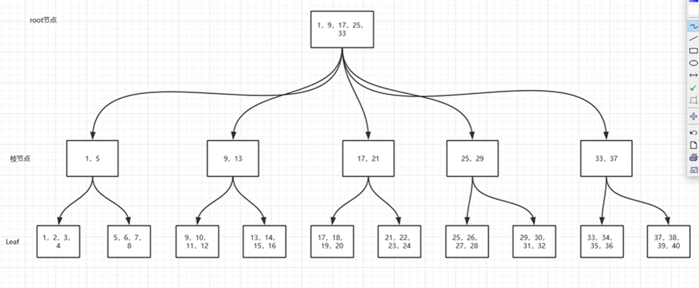
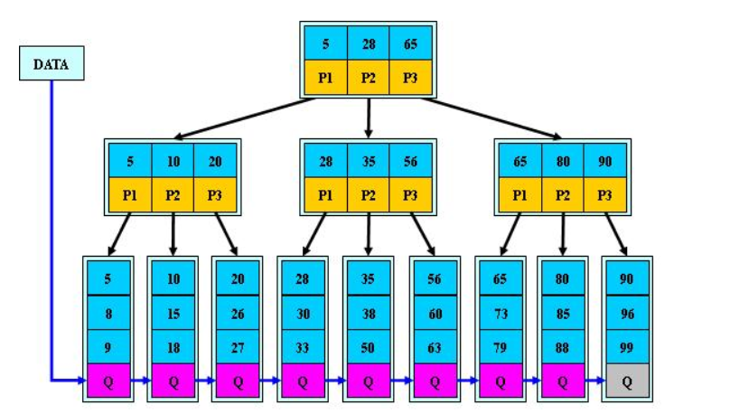
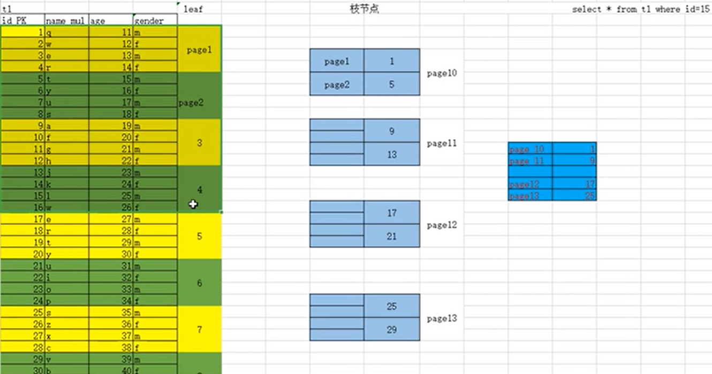
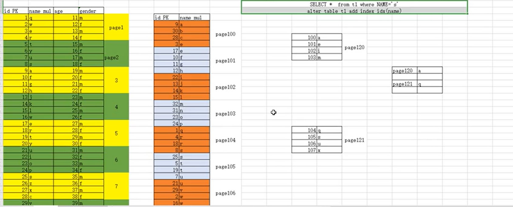
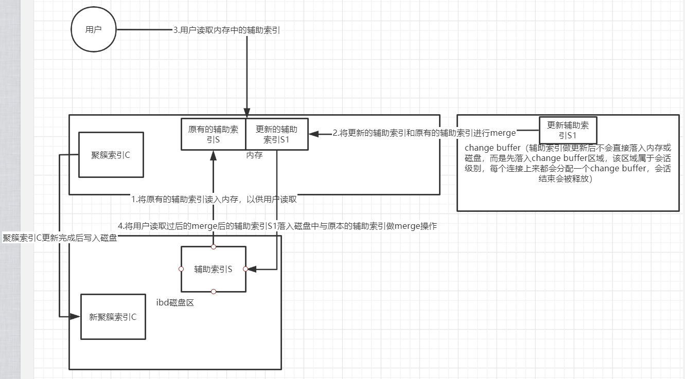

### 一、内连接和外连接

内连接(join on)：取两张表中有交集的数据
> inner join：select * from A join B on A.xx=B.yy

外连接(left join on || right join on)：
> - left join：取左表的所有数据，加上右表中和左表有交集的数据（即满足条件的数）
>> - select city.name,country.name,city.population from city left join country on city.countrycode=country.code and city.population < 100
> - right join：取右表的所有数据，加上左表中和右表有交集的数据

### 二、索引？

参考：https://blog.csdn.net/tongdanping/article/details/79878302

1.创建索引

在创建表的时候添加索引
```shell
CREATE TABLE mytable(  
    ID INT NOT NULL,   
    username VARCHAR(16) NOT NULL,  
    INDEX [indexName] (username(length))  
);
```

在创建表以后添加索引
```shell
ALTER TABLE my_table ADD [UNIQUE] INDEX index_name(column_name);
或者
CREATE INDEX index_name ON my_table(column_name);
```

2.删除索引
```shell
DROP INDEX my_index ON tablename；
或者
ALTER TABLE table_name DROP INDEX index_name;
```

3.查看表中的索引
```shell
SHOW INDEX FROM tablename
```

### 三、索引的优缺点？
> - 优势：可以快速检索，减少I/O次数，加快检索速度；根据索引分组和排序，可以加快分组和排序
> - 劣势：索引本身也是表，因此会占用存储空间，一般来说，索引表占用的空间的数据表的1.5倍；索引表的维护和创建需要时间成本，这个成本随着数据量增大而增大；构建索引会降低数据表的修改操作（删除，添加，修改）的效率，因为在修改数据表的同时还需要修改索引表

### 四、索引分类？
**常见的索引类型有：主键索引、唯一索引、普通索引、全文索引、组合索引**

1.主键索引：即主索引，根据主键pk_clolum（length）建立索引，不允许重复，不允许空值
> ALTER TABLE 'table_name' ADD PRIMARY KEY pk_index('col')

2.唯一索引：用来建立索引的列的值必须是唯一的，允许空值
> ALTER TABLE 'table_name' ADD UNIQUE index_name('col')

3.普通索引：用表中的普通列构建的索引，没有任何限制
> ALTER TABLE 'table_name' ADD INDEX index_name('col')

4.全文索引：用大文本对象的列构建的索引
> ALTER TABLE 'table_name' ADD FULLTEXT INDEX ft_index('col')

5.组合索引：用多个列组合构建的索引，这多个列中的值不允许有空值
> ALTER TABLE 'table_name' ADD INDEX index_name('col1','col2','col3')

**遵循“最左前缀”原则，把最常用作为检索或排序的列放在最左，依次递减，组合索引相当于建立了col1,col1col2,col1col2col3三个索引，而col2或者col3是不能使用索引的**

**在使用组合索引的时候可能因为列名长度过长而导致索引的key太大，导致效率降低，在允许的情况下，可以只取col1和col2的前几个字符作为索引**

使用col1的前4个字符和col2的前3个字符作为索引
> ALTER TABLE 'table_name' ADD INDEX index_name(col1(4),col2（3))

1.什么时候要使用索引？
> - 主键自动建立唯一索引
> - 经常作为查询条件在WHERE或者ORDER BY 语句中出现的列要建立索引
> - 作为排序的列要建立索引
> - 查询中与其他表关联的字段，外键关系建立索引
> - 高并发条件下倾向组合索引
> - 用于聚合函数的列可以建立索引，例如使用了max(column_1)或者count(column_1)时的column_1就需要建立索引

2.什么时候不要使用索引？
> - 经常增删改的列不要建立索引
> - 有大量重复的列不建立索引
> - 表记录太少不要建立索引。只有当数据库里已经有了足够多的测试数据时，它的性能测试结果才有实际参考价值。如果在测试数据库里只有几百条数据记录，它们往往在执行完第一条查询命令之后就被全部加载到内存里，这将使后续的查询命令都执行得非常快--不管有没有使用索引。只有当数据库里的记录超过了1000条、数据总量也超过了MySQL服务器上的内存总量时，数据库的性能测试结果才有意义

3.索引失效的情况
> - 在组合索引中不能有列的值为NULL，如果有，那么这一列对组合索引就是无效的
> - 在一个SELECT语句中，索引只能使用一次，如果在WHERE中使用了，那么在ORDER BY中就不要用了
> - LIKE操作中，'%aaa%'不会使用索引，也就是索引会失效，但是‘aaa%’可以使用索引
> - 在索引的列上使用表达式或者函数会使索引失效，例如：select * from users where YEAR(adddate)<2007，将在每个行上进行运算，这将导致索引失效而进行全表扫描，因此我们可以改成：select * from users where adddate<’2007-01-01′。其它通配符同样，也就是说，在查询条件中使用正则表达式时，只有在搜索模板的第一个字符不是通配符的情况下才能使用索引
> - 在查询条件中使用不等于，包括<符号、>符号和！=会导致索引失效。特别的是如果对主键索引使用！=则不会使索引失效，如果对主键索引或者整数类型的索引使用<符号或者>符号不会使索引失效。（不等于，包括&lt;符号、>符号和！，如果占总记录的比例很小的话，也不会失效）
> - 在查询条件中使用IS NULL或者IS NOT NULL会导致索引失效
> - 字符串不加单引号会导致索引失效。更准确的说是类型不一致会导致失效，比如字段email是字符串类型的，使用WHERE email=99999 则会导致失败，应该改为WHERE email='99999'
> - 在查询条件中使用OR连接多个条件会导致索引失效，除非OR链接的每个条件都加上索引，这时应该改为两次查询，然后用UNION ALL连接起来
> - 如果排序的字段使用了索引，那么select的字段也要是索引字段，否则索引失效。特别的是如果排序的是主键索引则select * 也不会导致索引失效
> - 尽量不要包括多列排序，如果一定要，最好为这队列构建组合索引

### 五、BTree种类

> - B-Tree
> - B+Tree(在叶子节点处加入指向前后节点的指针，减少IO) ---> B*Tree(在支子节点处加入指向前后节点的指针，减少IO)



### 六、聚簇索引（InnoDB独有）

> 聚簇索引的叶子节点存储索引及具体的数据

构建前提：
> - 建表时，指定了主键列，MySQL InnoDB会讲主键作为聚簇索引列，比如ID not null primary key
> - 没有指定主键，自动选择唯一键（unique）的列，作为聚簇索引
> - 以上都没有，会生成隐藏聚簇索引

作用：
> 有了聚簇索引之后，将来插入的数据行，在同一个区内，都会按照ID值得顺序，有序在磁盘存储数据

聚簇索引结构



### 七、辅助索引

> 使用普通列作为条件构建的索引（辅助聚簇索引）

作用：
> 优化非聚簇索引列之外的查询条件的优化

类型：
> - 单列索引
> - 联合索引：最左原则（由多列组合一个索引）
>> - 查询条件必须包含最左的索引作为条件，eg.index(a,b,c)，必须包含a列
>> - 建立联合索引时，一定要选择重复值少的列，作为最左列
> - 前缀索引：针对于所选择的列值长度过长，构建索引时会导致索引树高度增高，会导致索引应用时，需要读取更多的索引数据页，MYSQL建议索引树高度在3-4层，所以前缀索引可以选择大字段的前面部分字符作为索引生成条件

联合索引的全部覆盖（idx(a,b,c)）
> - select * from t where a= and b= and c=
> - select * from t where a in and b in and c=
> - select * from t where b= and c= and a=

联合索引的部分覆盖（idx(a,b,c)）：
> - select * from t where a= and b=
> - select * from t where a= 
> - select * from t where a= and c=
> - select * from t where a= and b > < >= <= like and c= (由于b时取范围值，所以此查询语句只能覆盖到ab，而不能覆盖到c)
> - select xxx from t where a= order by b(走ab索引，order by语句必须要按照索引的顺序，a开始)
> - select xxx from t where a= and b = order by c(走abc索引，order by语句必须要按照索引的顺序，a开始)

不覆盖联合索引（idx(a,b,c)）：


> 辅助索引构建之后，在辅助索引结构查询到具体的id，再拿该id到聚簇索引中重新查找





B+tree索引树高度影响因素：
> - 索引字段较长：前缀索引
> - 数据行过多：分区表、归档表、分布式架构
> - 数据类型：选择合适的数据类型

回表查询？
> mysql用来存储数据行的逻辑结构，表的数据行最终存储到了很多的page上，innodb存储引擎会按照聚簇索引，有序的组织存储表数据到各个区的连续的页上，这些连续的数据页，成为了聚簇索引的叶子节点，可认为聚簇索引就是原表数据，即 回表 即是 回聚簇索引

辅助索引：
> 将辅助索引列值 + ID主键值，构建辅助索引B树结构，当用户使用辅助索引列作为条件查询时，首先扫描辅助索引的b树
>> - 如果时辅助索引能够完全覆盖查询结果时，就不需要回表
>> - 如果不能完全覆盖到，只能通过得出的ID主键值，回到聚簇索引（回表）扫描，最终得到想要的结果

回表的影响：
> - IO量级变大
> - IOPS（IO次数）会增大
> - 随机IO会增大

如何减少回表：
> - 将查询尽可能用ID主键查询
> - 设计合理的联合索引
> - 更精确的查询条件+联合索引
> - 优化器算法：MRR

> insert、update、delete数据，对于聚簇索引会立即更新，对于辅助索引，不是实时更新的，先落入change buffer。过程如下：



### 八、索引的管理命令

什么时候创建索引？
> 并不是将所有列都建立索引。不是索引越多越好，按照业务语句的需求创建合适的索引，将索引建立在，经常 where、group by、order by、join on...的条件

乱建索引的坏处？
> - 如果冗余索引过多，表的数据变化的时候，很有可能会导致索引频繁更新，会阻塞很多正常的业务更新的请求
> - 索引过多，会导致优化器选择出现偏差

管理命令：
> - desc city 或 show index from city; 查询表的索引情况，key列：PRI聚簇索引、MUL辅助索引、UNI唯一索引
> - alter table city add index idx_na(name); 创建索引
> - alter table city drop index idx_na; 删除索引
> - alter table city add index idx_na(name,country); 创建联合索引 
> - alter table city add index idx_na(district(5)); 创建前缀索引，取前五个字符
> -  

压测命令：
> mysqlslap --defaults-file=/etc/my.cnf \ --concurrency=100 --iterations=1 --create-schema='test' \ --query="select * from test.t100w where k2='780p'" engine=innodb \ -- number-of-queries=200 -uroot -p123 -verbose

### 九、执行计划

> 使用explain 或 desc，后面跟随具体的sql查看即可

执行计划显示结果的分析：
> - table：此次查询设计到的表
> - type：查询类型（全表扫描ALL 或 索引扫描index < range < ref < eq_ref < const(system)）
> - possible_keys：可能用到的索引
> - key：最后选择的索引
> - key_len：索引的覆盖长度（主要用于评估联合索引）
> - rows：此次查询需要扫描的行数
> - Extra：额外的信息

索引扫描index < range < ref < eq_ref < const(system)
> - index：全索引扫描，需要扫描整颗索引树，eg. desc select countrycode from world.city
> - range：索引范围查询，> < >= <= like in or between and（like例外说明匹配最左前缀索引，不可'%ch%,可'ch%'），eg. desc select * from city where id < 10 或 desc select * from city where countrycode like 'CH%'
> - ref：辅助索引的等值查询，eg. desc select * from city where countrycode='CHN'
> - eq_ref：针对多表连接中，非驱动表连接条件是主键或唯一键，eg. desc select country.name,city.name from city join country on city.countrycode = country.code where city.population='CHN'（country为非驱动表，country.code中的code为country表中的唯一键）
> - const(或system)：聚簇索引等值查询，eg. desc select * from city where id=10 (id为主键)


 


