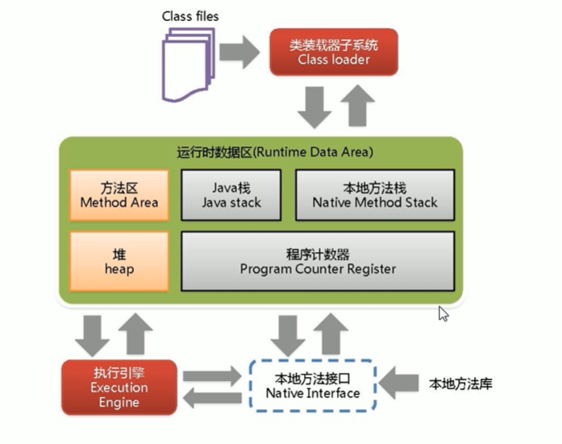
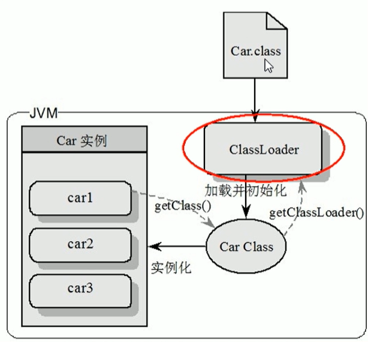
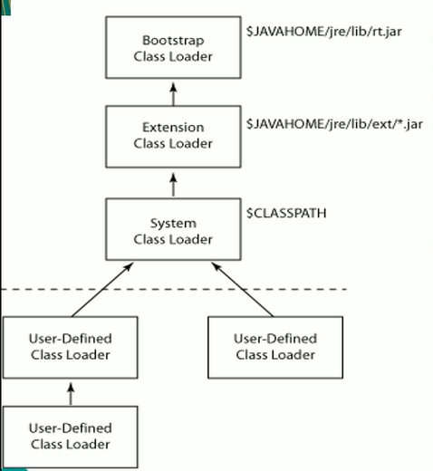
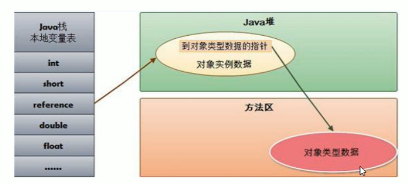
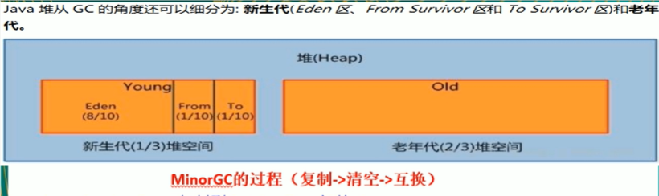
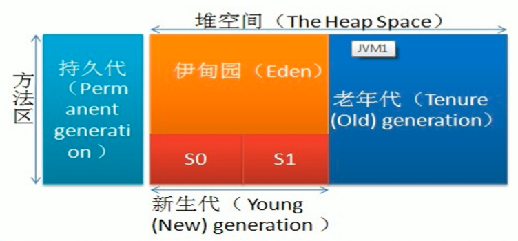
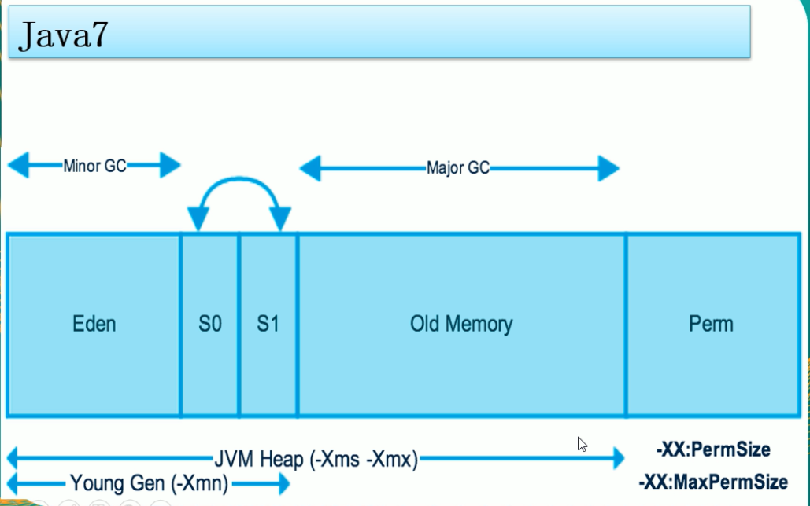
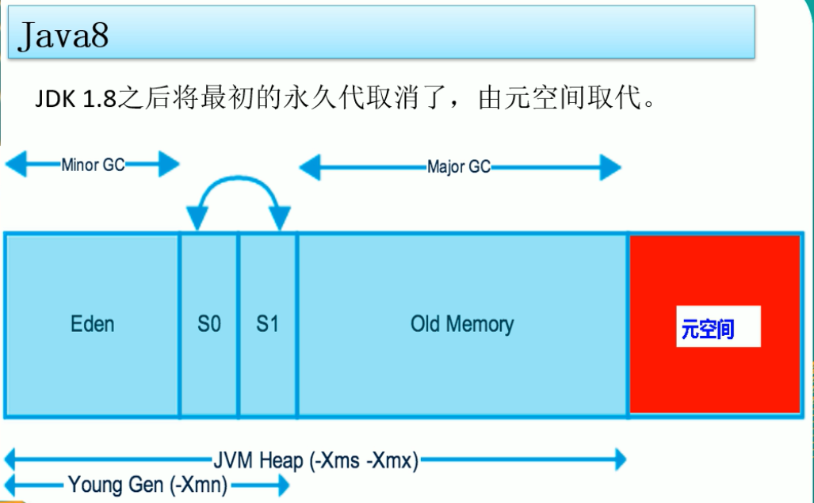

### 一、体系结构

### 二、类装载器

> 类装载器ClassLoader：负责加载class文件，class文件在**文件开头有特定的文件标识（cafe babe...）**，将class文件字节码内容加载到内存中，并将这些内容转换成方法区中的运行时数据结构并且classLoder只负责class文件的加载，值与它是否可以运行，则由Execution Engine决定

类装载器种类：

虚拟机自带的加载器(系统自带)：
> 启动类加载器（Bootstrap）C++ （Object对象获取加载器为null，因为Bootstrap对应的C++为最高级）
> 扩展类加载器（Extension）JAVA
> 应用程序类加载器（AppClassLoader）java也叫系统类加载器，加载当前应用的classPath的所有类（自创建的对象eg MyObject获取加载器为AppClassLoader）

用户自定义加载器:
> java.lang.ClassLoader的子类，用户可以定制类的加载方式

ClassLoader的双亲委派机制
> 当一个类收到了类加载请求，它首先不会尝试自己去加载这个类，而是把这个请求委派给父类去完成，每一个层次类加载器都是如此，因此所有的加载请求都应该传送到启动类加载其中，只有当父类加载器反馈自己无法完成这个请求的时候（在它的加载路径下没有找到所需加载的class），子类加载器才会去尝试自己加载。采用双亲委派的一个好处就是比如加载位于rt.jar包中的类java.lang.Object，不管是哪个加载器加载这个类，最终都是委托给顶层的启动类加载器进行加载，这样就保证了使用不同的类加载器最终得到的都是同样一个Object对象

Execution Engine执行引擎负责解释命令，提交操作系统执行

沙箱安全机制：防止恶意代码污染java源代码，eg String

### 三、本地方法栈

本地方法接口Native修饰放于本地方法栈中运行，eg Thread中的start方法

> - Nativ Interface本地接口：本地接口的作用是融合不同的变成语言为java所用，他的初衷是融合C/C++程序
> - Native Method Stack：Native MethodStack中等级native方法，在Execution Engine执行时加载本地方法库

native关键字，有声明，无实现，调用第三方C语言函数库去实现

**线程私有：java栈、程序计数器、本地方法栈（线程私有的部分不需要GC）**

### 四、程序计数器（Program Counter Register）

> - PC寄存器：位于cpu中，每个线程都有一个程序计数器，是**线程私有**的，就是一个指针，只想方法区中的方法字节码（**用来存储指向下一条指令的地址，也即将要执行的指令代码**），由执行引擎读取下一条指令，是一个非常小的内存空间，几乎可以忽略不记。
> - 这块内存区域很小，他是**当前线程所执行的字节码的行号指示器**，字节码解释器通过改变这个计数器的值来选取下一条需要执行的字节码指令
> - 如果执行的是一个Native方法，那这个计数器是空的
> - 用以完成分支、循环、跳转、异常处理、线程恢复等基础功能。不会发生内存溢出（OutOfMemoryError=OOM）错误

### 五、方法区

> 供各线程共享得运行时内存区域。**它存储了每一个类得结构信息**，例如运行时常量池（Runtime Constant Pool）、字段和方法数据、构造函数额普通方法的字节码内容。上面讲得是规范，在不同虚拟机里头实现是不一样的，对典型的就是永久代（PermGen space）和元空间（Metaspace），但是，**实例变量存在堆内存中，和方法区无关**

### 六、Java栈（栈管运行，堆管存储）

> 栈也叫栈内存，主管Java程序的运行，是在线程创建时创建，它的生命期是跟随线程的生命期，线程结束栈内存也就释放，**对于栈来说不存在垃圾回收问题**，只要线程一结束该栈就over，生命周期和线程一致，是线程私有的。**8种基本类型的变量+对象的引用变量+实例方法都是在函数的栈内存中分配**

栈帧中主要保存3类数据：
> - 本地变量（Local Variables）：输入参数和输出参数以及方法内的变量
> - 栈操作（Operand Stack）：记录出栈、入栈的操作
> - 栈帧数据（Frame Data）：包括类文件、方法等

队列（先进先出 eg 排队打饭），栈（后进先出 eg 子弹匣）

> 每个方法方法执行的同时都会创建一个栈帧，用于存储局部变量表、操作数栈、动态链接、方法出口等信息，每一个方法从调用直至执行完毕的过程，就对应着一个栈帧在虚拟机中入栈到出占的过程。栈的大小和具体JVM的实现有关，通常在256~756k之间，与等于1mb左右。

java.lang.StackOverflowError

HotSpot是使用指针的方式来访问对象：Java堆中回存放访问类**元数据**的地址，reference存储的就直接是对象的地址

栈+堆+方法区的交互关系：

> 针对于reference对象，存储在java堆中，但它区分模板的不同则是根据方法区中的对象类型数据

### 七、Java堆

一个JVM实例只存在一个堆内存，堆内存的大小是可以调节的，类加载器读取了类文件后，需要把类、方法、常变量放到堆内存中，保存所有引用类型的真实信息，以方便执行器执行，堆内存分为三部分：
> - Young Generation Space 新生代：Young/New（eden区、Survivor 0区（from）、Survivor  1区（to））
> - Tenure Generation Space 老年代 Old/Tenure
> - Permanent Space 永久代 Perm（1.7V） 元空间（1.8V），对应Method Area

> 新生区是类的诞生、成长、消亡的区域，一个类在这里产生，应用，最后被垃圾回收器收集，结束生命。新生区分为两部分：eden space和suvivor space，所有的类都是在eden区被new出来的，survivor区中有0区和1区，当eden区的空间用完时，程序又需要创建对象，JVM的垃圾回收器对eden进行垃圾回收（Young GC/Minor GC），将eden区中的不再被其他对象所引用的对象进行销毁，然后将eden区中的剩余对象移动到survivor0区，若survivor 0区也满了，再对该区进行垃圾回收，然后移动到1区，若1区满了，再移动到养老区，若养老区也满了，则会触发Full GC，进行养老区的内存清理，若养老区执行了full GC后依然无法进行对象的保存，则会产生java.lang.OutOfMemoryError:java heap space异常
> - 如果出现OOM异常，说明java虚拟机的堆内存不够，原因：
>> - 1.java虚拟机的堆内存设置不够，可以通过参数-Xms、-Xmx来调整
>> - 2.代码中创建了大量大对象，并且长时间不能被垃圾收集器收集（存在被引用）

from区和to区，他们的位置不是固定的，每次GC后回交换，谁空谁是to区

> - eden、SurvivorFrom复制到SurvivorTo，年龄+1：首先，当eden区满的时候会触发第一次GC，把还活着的对象拷贝到SurvivorFrom区，当eden区再次触发GC的时候会扫描eden区喝From区域，对这两个区域进行垃圾回收，经过这次回收后还存活的对象，则直接复制到To区域（如果有对象的年龄已经达到了老年的标准，则复制到老年代区），同时把这些对象的年龄+1。
> - 清空eden、SurvivorFrom：然后，清空eden和SurvivorFrom中的对象，也即复制之后有交换，谁空谁是to
> - SurvivorTo和SurvivorFrom互换：最后，SurvivorTo和SurvivorFrom互换，原SurvivorTo成为下一次GC时的SurvivorFrom区。部分对象会在From和To区域中复制来复制区，如此交换15次（由JVM参数MaxTenuringThreshold决定，此参数默认是15），最终如果还是存活，就存入到老年代

**JVM规范将方法区描述为堆的一个逻辑部分，但它还有一个别名叫做Non-Heap（非堆），目的就是要和堆分开。**

对于HotSpot虚拟机，很多开发者习惯将方法区称之为永久代（Permanent Gen），但严格本质上说两者不同，或者说使用永久代来实现方法区而已，永久代是方法区（相当于是一个接口interface）的一个实现，jdk1.7的版本中，已经将原本放在永久代的字符串常量池移走

永久区（java7之前有）：

    永久存储区是一个常驻内存区域，用于存放JDK自身所携带的Class，Interface的元数据，也就是说它存储的是运行环境必须的类信息，被装在进此区域的数据是不会被垃圾回收器回收掉的，关闭JVM才会释放此区域所占用的内存（eg jar包）

### 八、堆参数的调优

java1.7

java1.8

Java8
> 在java8中，永久代已经被移除，被一个称为元空间的区域所取代，元空间的本质和永久代类似。元空间与永久代之间最大的区别在于：永久代使用的JVM的堆内存，**但是java8以后的元空间并不在虚拟机中而是使用本机物理内存**，因此，默认情况下，元空间的大小仅受本地内存限制，类的元数据放入native memory，字符串池和类的静态变量放入java堆中，这样可以加载多少类的元数据就不再由maxPermSize控制，而由系统的实际可用空间来控制

#### 8.1、堆内存调优

| 参数  | 含义                                |
| -----  | ------------------------------------|
| -Xms  | 设置初始分配大小，默认为物理内存的1/64  |
| -Xmx  | 最大分配内存，默认为物理内存的1/4      |
| -XX:+PrintGCDetails  | 输出详细的GC处理日志   |

